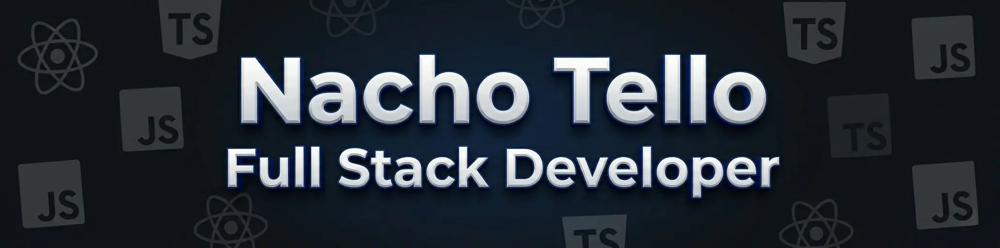

# Nacho Tello

### Full Stack Developer

Building scalable web applications with React, TypeScript, Node.js, and modern development workflows.

---

## About Me

I discovered programming in 2022, and it quickly became one of my greatest passions.

What started as simple curiosity evolved into something I genuinely enjoy every day. I’m passionate about building digital products, solving complex problems, and continuously learning new technologies and development methodologies.

Throughout this journey, I have worked on Full Stack projects across both frontend and backend development, designing modern user interfaces, building robust APIs, and managing databases to create complete end-to-end applications.

Today, I continue expanding my knowledge in software architecture, scalable backend development, AI-powered tools, and professional engineering practices.

Outside of technology, I enjoy drinking mate, listening to rock music, and Argentine folk music. Some of my best project ideas come while coding with a good playlist and a few rounds of mate.

---

## Technologies & Tools

### Frontend

  

### Backend

  

**Additional experience with:**

- SQL
- Strapi
- Mongoose
- JWT
- Bcrypt

### Tools

  

**Other tools I regularly use:**

- Prettier
- CI/CD workflows
- Git-based version control
- REST API design
- Application deployment and hosting

---

## AI-Assisted Development

I use AI tools to enhance productivity, accelerate research, and improve solution design while always prioritizing technical judgment, code quality, and maintainability.

**Tools I regularly work with:**

- Cursor
- Claude Code
- OpenCode
- GitHub Copilot
- Codex
- ChatGPT
- Gemini
- Google Stitch
- Replit Agent
- Lovable
- Bolt.new

---

## Engineering Principles

- Clean and maintainable code
- Scalable architectures
- Development best practices
- Well-designed and documented APIs
- User-centered thinking
- Process automation
- Continuous learning
- Responsible and strategic use of AI tools

---

## Currently

- Building Full Stack applications with React, TypeScript, and Node.js
- Deepening my expertise in NestJS and backend architecture
- Exploring modern AI-assisted development workflows
- Improving development, testing, and deployment processes

---

## GitHub Analytics

  
  

---

## Contact

  <a href="www.linkedin.com/in/ignacio-tello-33249b280">LinkedIn</a> •
  <a href="https://portfolionachotello.netlify.app/en">Portfolio</a> •
  <a href="mailto:ignacio.tello.dev@gmail.com">Email</a>

---

*"La programación es una combinación entre creatividad, aprendizaje constante y resolución de problemas. Cada proyecto representa una nueva oportunidad para construir algo mejor."*

